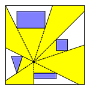
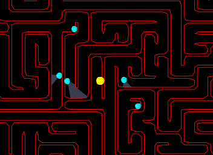

# PlanarSight
PlanarSight is a course project for Computational Geometry (CS 7024-0183). The course taught by Dr Deng really impressed me and make me feel like diving to the world of computational geometry. This project is a small game made by some advanced algorithms like constrained Delaunay triangulation and visibility polygon construction.

Here is a snapshot about this game:

